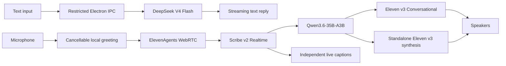

# AI-KANOJO

English | [简体中文](README.md)

A voice-first AI desktop companion prototype for Windows. It combines a transparent always-on-top Electron character, DeepSeek text chat, and ElevenLabs real-time voice conversations in one lightweight interface.

> This project is still a prototype. Character personality and relationship design have not been integrated yet; the current build keeps only the protocol guardrails required for trilingual routing.

## Features

- Transparent, frameless, always-on-top desktop companion with dragging, position restore, locking, minimization, and a system tray.
- Streaming text chat through DeepSeek with recent local chat history.
- Continuous voice conversations that follow the current turn in Chinese, English, or Japanese.
- Live partial captions, committed transcripts, thinking/speaking states, multi-turn operation, and error recovery.
- A microphone hover/focus menu for switching between Real-time Conversation and Expressive modes.
- Settings for personal ElevenLabs voices, microphone selection, the conversation portrait, and four canonical 8-bit state images.
- A random, cancellable Japanese or English greeting before each voice session; the microphone stays closed during greeting playback.
- Electron `safeStorage` for long-lived API keys; the renderer receives only short-lived session credentials.

## Architecture



Text and voice use separate routes:

| Scenario | Models and behavior |
| --- | --- |
| Text chat | `deepseek-v4-flash` with thinking disabled. It receives at most 24 sanitized user/assistant messages and no system, persona, or response-length prompt. |
| Real-time Conversation | `scribe_v2_realtime` → ElevenAgents-native `qwen36-35b-a3b` → `eleven_v3_conversational`. The microphone remains live and barge-in is supported. |
| Expressive | The same ElevenAgents transcription and LLM path, with the reply text rendered through standalone `eleven_v3`. The microphone is muted during playback, so this mode is intentionally non-interruptible. |

The voice Agent keeps exactly three protocol guardrails: respond in the current turn's Chinese, English, or Japanese; silently call `language_detection` after a genuine language change; and never expose tool arguments, language codes, internal reasoning, or routing commentary. Automatic LLM and TTS fallback is disabled.

## Requirements

- Windows 10/11 x64
- Node.js 20 or newer
- A working DeepSeek API key
- An ElevenLabs API key, a personal Voice, and an existing ElevenAgent
- Access to `Qwen3.6-35B-A3B`, Scribe v2 Realtime, and Eleven v3 models in the ElevenLabs Workspace
- Microphone permission and a working audio output device

## Run locally

```powershell
git clone https://github.com/wantedfast/AI-KANOJO.git
cd AI-KANOJO
npm install
npm run desktop
```

`npm run desktop` creates a production build before launching the real Electron desktop window. To inspect only the browser UI, run:

```powershell
npm run dev
```

The browser preview uses a frontend demo contract. It neither stores nor sends long-lived API keys and does not replace real Electron voice acceptance testing.

## Credentials and ElevenAgent setup

The current prototype does not display API keys or a voice-model selector in Settings. Settings contains voice, microphone, and character asset controls; voice mode is selected from the microphone hover/focus menu.

On first launch, the app attempts to read `DS and ElevenLabs.txt` from the Windows desktop. The file must contain exactly two lines:

```text
<DeepSeek API Key> DS
<ElevenLabs API Key> ElevenLabs
```

Both keys are imported atomically only when both lines parse successfully and secure storage is available. The source file is preserved. Runtime copies are encrypted using Electron `safeStorage`, backed by Windows protection.

Voice operation also requires an accessible ElevenAgent ID in application state. When an Agent ID is saved or revalidated, the backend reads the complete cloud configuration, resolves the exact Qwen model ID available to the Workspace, updates the Agent, and reads it back for verification. This prototype does not yet expose an end-user Agent ID setup screen, so a clean installation must be provisioned through the restricted backend configuration flow first.

When a different voice is saved, the app lists only personal voices from the ElevenLabs account and synchronizes the selected Voice ID to the existing Agent. Never commit API keys, Agent IDs, user state files, or other credentials.

## Voice modes

Clicking the idle microphone starts the last saved mode. Hover for about 350 ms, or focus it with the keyboard, to open the mode menu.

- **Real-time Conversation** uses `eleven_v3_conversational`. It is low-latency, continuous, and supports interrupting the assistant while it speaks.
- **Expressive** uses standalone `eleven_v3` synthesis. It prioritizes vocal rendering and pauses capture during playback, so real-time interruption is unavailable.

The caption sidecar constrains recognition to Chinese as the primary language with English and Japanese as secondary languages. It enables echo cancellation, noise suppression, and background-audio filtering. Punctuation-only noise and transcripts without Unicode letters or numbers do not create user turns.

## Development commands

| Command | Purpose |
| --- | --- |
| `npm run dev` | Start the Vite browser preview |
| `npm run build` | Build the client and prepare Sites artifacts |
| `npm run desktop` | Build and launch Electron |
| `npm test` | Run the Vitest suite |
| `npm run test:sites` | Validate the Sites Worker package |
| `npm run test:electron` | Run the real Electron window smoke test |
| `npm run test:elevenagents:live` | Run the live ElevenAgents smoke test with locally configured services |
| `npm run verify` | Run the complete local verification pipeline |
| `npm run package:win` | Build the Windows x64 portable EXE into `release/` |

The live smoke test consumes real provider quota and may update the currently saved ElevenAgent configuration. Run it only when explicitly needed.

## Repository layout

```text
src/        React UI, conversation adapter, live captions, and state flow
electron/   Main process, IPC, secure storage, providers, and Agent configuration
shared/     Fixed model and cross-process contracts
tests/      Unit, component, integration, and configuration tests
tools/      Electron and live ElevenAgents smoke tests
public/     Runtime character assets, greeting audio, and other static files
assets/     Design sources, icons, and the asset catalog
docs/       Product requirements and historical validation documents
```

## Security and responsible use

- Never expose API keys in issues, logs, screenshots, or commits.
- Use only voices and character assets that you own or are authorized to use.
- Model and speech providers may reject requests under their own policies; this project does not provide mechanisms for bypassing provider safeguards.
- The repository currently has no root license file. Do not assume that its code or assets may be freely redistributed until a license is explicitly added.

## Project documents

- [Product requirements (Chinese)](docs/PRD.md)
- [Simple conversation validation PRD (Chinese)](docs/PRD-simple-conversation-validation.md)
- [Asset catalog](assets/ASSET-CATALOG.md)
- [Asset gallery](assets/gallery.html)
- [Design QA](design-qa.md)
