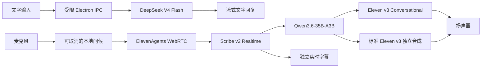

# AI-KANOJO

[English](README.en.md) | 简体中文

一个面向 Windows 的语音优先 AI 桌面伴侣原型。它将透明置顶 Electron 桌面角色、DeepSeek 文字聊天和 ElevenLabs 实时语音会话整合在同一个轻量界面中。

> 当前版本仍是原型。角色人格与关系设定尚未接入；现阶段只保留必要的三语路由护栏。

## 功能概览

- 透明、无边框、置顶的桌面伴侣窗口，支持拖动、位置恢复、锁定、最小化和系统托盘。
- 文字聊天直接流式调用 DeepSeek，并保存最近的本地聊天记录。
- 连续语音对话支持中文、英文、日文随当前轮次自动切换。
- 实时临时字幕、正式转录、思考/回复状态、多轮对话和错误恢复。
- 麦克风悬停或键盘聚焦后可选择“实时对话”或“表现力优先”。
- 设置中可选择 ElevenLabs 个人音色、麦克风，以及替换对话立绘和四种 8-bit 状态图。
- 进入语音模式前随机播放一段可取消的日语或英语问候；播放期间不会开启麦克风。
- Electron `safeStorage` 加密长期 API Key，渲染进程只获得短期会话凭证。

## 当前架构



文字与语音使用两条独立路由：

| 场景 | 模型与行为 |
| --- | --- |
| 文字聊天 | `deepseek-v4-flash`，关闭 thinking，最多携带最近 24 条已清理的用户/助手消息，不注入系统、人格或长度提示词 |
| 实时对话 | `scribe_v2_realtime` → ElevenAgents 原生 `qwen36-35b-a3b` → `eleven_v3_conversational`，保持麦克风在线并支持打断 |
| 表现力优先 | 同一 ElevenAgents 转录与 LLM 链路，回复文字交给独立 `eleven_v3` 合成；播放时麦克风静音，不支持打断 |

语音 Agent 只保留三项协议护栏：按当前轮次的中文、英文或日文回答；语言发生真实变化时静默调用 `language_detection`；绝不把工具参数、语言代码、内部推理或路由说明说给用户。LLM 与 TTS 均禁用自动降级。

## 环境要求

- Windows 10/11 x64
- Node.js 20 或更高版本
- 可用的 DeepSeek API Key
- 可用的 ElevenLabs API Key、个人 Voice 和已有 ElevenAgent
- ElevenLabs Workspace 中可用的 `Qwen3.6-35B-A3B`、Scribe v2 Realtime 与 Eleven v3 系列能力
- 麦克风权限与可用的音频输出设备

## 本地运行

```powershell
git clone https://github.com/wantedfast/AI-KANOJO.git
cd AI-KANOJO
npm install
npm run desktop
```

`npm run desktop` 会先生成生产构建，再启动真实 Electron 桌面窗口。只查看浏览器界面时可以运行：

```powershell
npm run dev
```

浏览器预览使用前端演示契约，不会保存或发送长期 API Key，也不能代替真实 Electron 语音验收。

## 凭据与 ElevenAgent 配置

当前原型不在设置界面显示 API Key 或语音模型选择器。设置页只包含音色、麦克风和角色资产；语音模式从麦克风的悬停/聚焦菜单选择。

首次启动时，应用会尝试读取桌面的 `DS and ElevenLabs.txt`。文件必须恰好包含两行：

```text
<DeepSeek API Key> DS
<ElevenLabs API Key> ElevenLabs
```

两个 Key 只有在同时解析成功且安全存储可用时才会被原子导入。明文文件不会被修改或删除；导入后的运行副本由 Windows 支持的 Electron `safeStorage` 加密保存。

此外，语音功能要求应用状态中已有一个可访问的 ElevenAgent ID。保存或重新验证 Agent ID 时，后端会读取完整云端配置、匹配 Workspace 中精确的 Qwen 模型 ID、更新 Agent，并重新读取校验。当前原型尚未提供面向最终用户的 Agent ID 配置界面，因此全新安装需要先通过受限后端配置流程完成预置。

保存新音色时，应用只列出 ElevenLabs 账户中的个人音色，并将所选 Voice ID 同步到现有 Agent。请勿将 API Key、Agent ID、用户状态文件或其他凭据提交到仓库。

## 语音模式

空闲时单击麦克风会使用上次保存的模式；悬停约 350 ms 或通过键盘聚焦会打开模式菜单。

- **实时对话**：使用 `eleven_v3_conversational`。低延迟、可连续多轮，支持在 AI 说话时打断。
- **表现力优先**：使用独立 `eleven_v3` 合成。音色表现优先，播放时暂停收音，因此不可实时打断。

实时字幕侧路将识别范围约束为中文主语言、英文和日文次语言，并启用回声消除、降噪和背景音过滤。纯标点、环境噪声或没有 Unicode 字母/数字的结果不会创建用户轮次。

## 开发命令

| 命令 | 用途 |
| --- | --- |
| `npm run dev` | 启动 Vite 浏览器预览 |
| `npm run build` | 构建客户端并准备 Sites 产物 |
| `npm run desktop` | 构建并启动 Electron |
| `npm test` | 运行 Vitest 测试 |
| `npm run test:sites` | 验证 Sites Worker 包装 |
| `npm run test:electron` | 运行真实 Electron 窗口烟测 |
| `npm run test:elevenagents:live` | 使用本机已配置的真实服务进行 ElevenAgents 在线烟测 |
| `npm run verify` | 运行完整本地验证链路 |
| `npm run package:win` | 构建 Windows x64 portable EXE 到 `release/` |

在线烟测会消耗真实服务额度并可能更新当前保存的 ElevenAgent 配置，请只在明确需要时运行。

## 项目结构

```text
src/        React 界面、会话适配器、实时字幕与状态流
electron/   主进程、IPC、安全存储、Provider 和 ElevenAgent 配置
shared/     固定模型与跨进程契约
tests/      单元、组件、集成和配置测试
tools/      Electron 与真实 ElevenAgents 烟测
public/     运行时角色、问候音频等静态资产
assets/     设计源文件、图标和资产清单
docs/       PRD 与历史验证文档
```

## 安全与使用说明

- 不要在 Issue、日志、截图或提交中公开 API Key。
- 仅使用你拥有或获授权使用的声音和角色资产。
- 语言模型与语音服务可能根据各自政策拒绝某些请求；项目不提供绕过服务安全限制的功能。
- 仓库当前没有根目录许可证文件。在许可证明确之前，请不要假定代码或资产可被自由再分发。

## 相关资料

- [产品需求](docs/PRD.md)
- [简易会话验证 PRD](docs/PRD-simple-conversation-validation.md)
- [资产清单](assets/ASSET-CATALOG.md)
- [资产 Gallery](assets/gallery.html)
- [设计 QA](design-qa.md)
