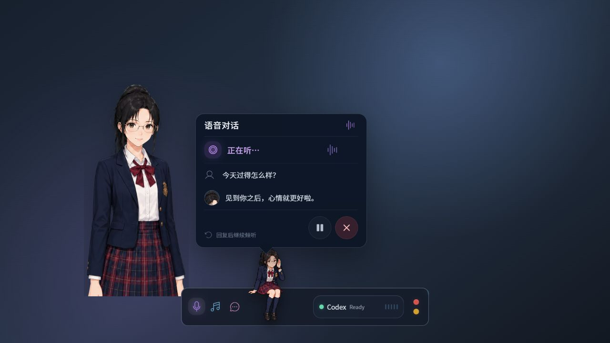

# AI-KANOJO 产品设计审查

审查日期：2026-08-03  
范围：闲置、语音对话、文字聊天、设置、最小化五个核心状态。  
方法：在 1280×720 本地预览中逐状态截图，并结合当前 React/CSS 的语义、焦点、字号、命中区域和减少动态效果实现进行检查。

## 总结

产品已经形成清晰的“桌面伴侣”辨识度，玻璃胶囊、角色资产和三类功能入口是一套完整视觉语言。当前主要问题不在美术质量，而在信息层级与入口语义：设置入口不可发现；对话时同时出现过多角色形象；Codex 状态比伴侣核心功能更显眼；文字聊天和设置内的部分文字、按钮过小。

建议先做三个低风险改进：增加明确的设置入口；精简对话时的重复角色头像；调整 Codex 与聊天内容的视觉权重。无需重做胶囊。

## 1. 闲置状态 — 健康度：良好

优点：胶囊低调、可爱，睡眠角色和深色玻璃形成了鲜明产品记忆；三种功能色能快速区分语音、音乐和文字入口。

问题：Codex Ready 区块占据最大视觉面积，但产品定位里 Codex 只是次要工作状态；三个图标完全依赖图形和悬停提示，首次使用者难以确定含义；纵向红/黄圆点容易被理解成状态灯而不是关闭/最小化。

建议：保持胶囊几何不变，仅降低 Codex 区块对比度约一级；首次启动给三个入口显示一次短暂标签；交通灯悬停时稳定显示关闭/最小化符号。

## 2. 语音对话 — 健康度：一般

优点：当前状态、用户话语、AI 回复和暂停/结束操作分区明确；界面能让用户知道系统正在听、想或说。

问题：同一画面同时出现大立绘、胶囊上的 8-bit 角色和回复行里的小头像，人物焦点被分散；气泡指向 8-bit 角色，但视觉上大立绘更像发言者，叙事锚点不一致；“回复后继续倾听”等辅助文字过小、对比度偏低。

建议：保留大立绘和 8-bit 状态角色，但移除回复行里的重复小头像；让气泡尾巴或空间关系明确指向大立绘；把状态和字幕作为唯一动态焦点。模型类型属于设置项，不建议塞进主对话面板。

## 3. 文字聊天 — 健康度：一般

优点：用户与 AI 消息左右区分清楚，历史区、输入区和在线状态符合熟悉的聊天心智模型。

问题：360px 面板再减去内边距后，中文消息换行过于频繁；时间戳、输入提示等使用 8–9px 小字；大立绘占用的面积明显大于聊天内容，使对话成为次要视觉元素；滚动条相对整体 Apple 风格偏重。

建议：将面板宽度提升至约 400–420px，或在不扩大 Electron 画布的前提下减少立绘与面板之间的空隙；正文保持 13–14px，辅助文字至少 10–11px；弱化滚动条，输入提示仅在输入框聚焦时出现。

## 4. 设置 — 健康度：需改进

优点：音色、模型、麦克风三项对齐清楚；API Key 已从界面移除；角色资产管理按肖像和四种状态分组，结构合理。

问题：设置只能通过右键胶囊打开，且“右键可打开”的提示只在已经打开设置后出现，是当前最严重的可发现性问题；常用声音设置和低频角色资产管理混在同一长面板；“完成”和“应用并保存设置”两个出口的保存语义不清；模型名称被截断；底部按钮贴近边缘，滚动条破坏整体精致感；多个标签、说明和替换按钮只有 9–10px 或约 28px 高。

建议：在胶囊交通灯附近增加一个轻量设置入口，右键继续作为快捷方式；设置内部拆成“声音”和“角色资产”两个分段/页签；将右上角“完成”改为明确的“取消”或关闭图标，并保留唯一主操作“保存”；模型名称允许两行或提供完整悬停提示；统一滚动条主题。

## 5. 最小化 — 健康度：良好但有交互风险

优点：体积极小，睡眠角色仍然保持品牌识别，适合长期驻留桌面。

问题：绿色圆点没有标签，容易被理解为“正在监听”；点击角色会“展开并开始语音”，点击箭头仅“展开”，两个相邻入口的结果不同，可能导致意外启动麦克风；小尺寸也降低拖动和展开的可发现性。

建议：展开操作统一只展开，不自动开始录音；语音仍由麦克风按钮明确启动；绿色点改为中性状态或悬停显示“已就绪”。

## 横向问题与优先级

### P1：先修

1. 增加可见的设置入口，不能只依赖右键。
2. 统一最小化状态的展开行为，避免意外开启麦克风。
3. 减少语音界面里的重复角色表示，明确谁在说话。

### P2：下一轮

1. 提高文字面板有效宽度与辅助文字字号。
2. 降低 Codex 状态的视觉权重，使伴侣功能成为主角。
3. 分离声音设置与角色资产管理，统一保存/关闭语义。

### P3：抛光

1. 统一金色、紫色、青色、粉色的使用规则，避免强调色过多。
2. 弱化原生滚动条，统一深色玻璃细节。
3. 首次使用时为图标入口提供一次性功能提示。

## 可访问性检查

正向证据：主要按钮具有可访问名称，表单控件有关联标签；代码支持 `prefers-reduced-motion`；交通灯和角色按钮存在键盘焦点样式。

风险：多个功能按钮只有 32–36px；部分焦点状态仅改变背景并移除默认 outline；大量辅助文字为 8–10px 且颜色透明度较低；红/黄交通灯主要依赖颜色表达。建议统一至少 40px 的桌面点击热区、清晰的 2px 焦点环，并对正文/辅助文字做实际对比度测量。

本次没有运行屏幕阅读器、系统高对比度或完整键盘路径测试，因此不能宣称达到 WCAG 合规；这些需要单独验收。

## 推荐设计方向

不需要推翻现有 Apple 极简胶囊。更好的方向是“一个角色焦点、一个当前任务、一个明确主操作”：闲置时只突出陪伴入口；对话时把字幕/消息放在第一层，角色作为情绪背景；设置时只保留单一保存语义。这样能保住现有辨识度，同时显著降低认知负担。
