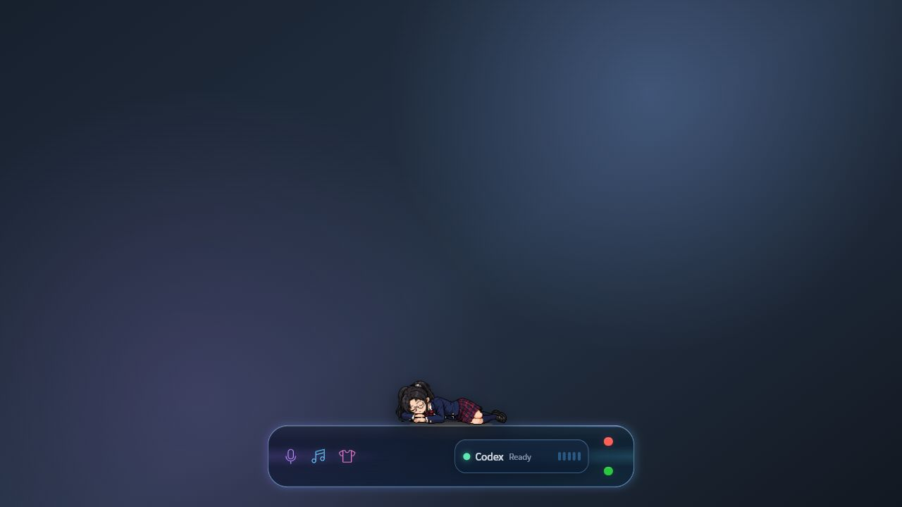
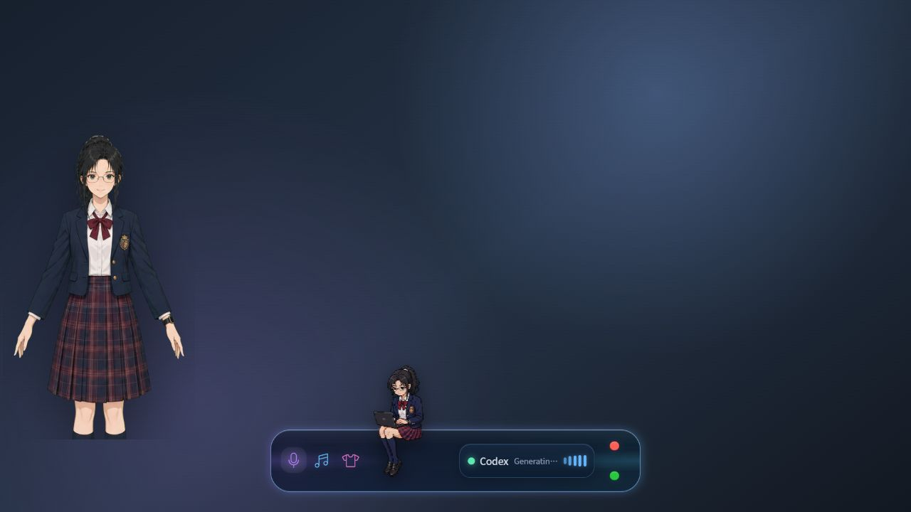

# AI-KANOJO UI 与布局审计（Apple 高级感）

## 审计范围

- 只审查 UI 视觉与布局，不审查业务逻辑、接口或功能完整性。
- 目标审美：苹果式清晰、克制、层级准确、留白稳定、材质服务内容。
- 当前审计基于 1280×720 浏览器预览的四个实时状态截图。

## 总体判断

当前完成度约 **7/10**。胶囊本体的形状、系统字体、深色材质和简化控制已经形成统一方向；距离苹果式高级感的主要差距不是“做得不够多”，而是唤醒态的两个角色争夺视觉中心、缩小态比例冲突、Codex 信息被压缩，以及霓虹描边和嵌套玻璃略显用力。

## 流程步骤

### Step 1 — 休眠态：良好

- 优点：520×88 的主体比例克制；睡姿角色与上沿关系自然；三个线性图标、Codex 与交通灯形成可读的单行结构。
- 风险：紫青外缘、内高光、Codex 阴影和图标霓虹同时存在，材质层数偏多，气质更接近精致游戏 HUD，而不是苹果的低存在感玻璃。
- 建议：保留紫青品牌色，但把常态光晕降低约 30–40%；颜色主要留给状态反馈，边框更多使用中性冷白。

### Step 2 — 唤醒但休眠：需要调整

- [P1] 2D 立绘独立贴在屏幕最左侧，胶囊居中，两者之间约有 106px 的断裂空隙；同时胶囊上还有一位 8-bit 角色，出现两个视觉主角。
- [P1] 构图重量明显偏左，右半屏几乎全空；角色与胶囊不像一个组件，更像两个互不相关的悬浮层。
- 建议：保留两种角色，但让 2D 立绘成为胶囊左端的附属层——靠近胶囊、轻微重叠或以 16–24px 的明确间距连接；降低其宽度到约 200–220px，避免与 8-bit 争夺第一视觉层级。

### Step 3 — Thinking / Codex Working：一般

- 优点：8-bit 工作角色位于图标与 Codex 之间，接触点自然且没有遮挡；角色尺度稳定。
- [P1] `Generating…` 在 Codex 胶囊内被截断成 `Generatin…`，直接破坏苹果式“信息永远完整”的清晰感。
- [P2] Codex 是外胶囊中的第二个高描边、高阴影胶囊，层级略重；五段动态柱、绿色状态点、文字状态同时表达“工作中”，信息重复。
- 建议：状态文字改成更短的 `Working`，或减少电平柱占位；Codex 内层降低边框和投影，只保留柔和填充与一个主要状态信号。

### Step 4 — 缩小态：需要调整

- [P1] 160px 长边角色覆盖在 112px 胶囊上方，角色比控件本身更宽，导致“缩小”只缩小了控制条，没有缩小桌面占用感。
- [P2] 小胶囊只有状态点与展开箭头，左右关系清楚，但角色和控件的组合重心偏上、比例头重脚轻。
- 建议：如果 8-bit 尺度必须绝对不变，缩小态胶囊宽度应至少接近角色长边（约 160px）；如果 112px 宽必须保留，则缩小态需要隐藏角色或只露出局部，而不是缩放角色。

## 最高影响问题

1. **唤醒态构图割裂**：2D 立绘与胶囊距离过远，且与 8-bit 同时抢主视觉。
2. **缩小态约束冲突**：160px 固定角色与 112px 控件无法同时保持“紧凑且平衡”。
3. **状态信息被截断**：Codex 工作文案没有完整显示。
4. **材质略显过度**：外缘霓虹、内层描边、阴影和多色状态同时发声。

## Apple 审美专项结论

- **Clarity / 清晰**：主功能可识别，但 Codex 截断和多重状态信号需要收敛。
- **Deference / 克制**：休眠态较好；唤醒态 2D 与 8-bit 同时出现，界面没有退居内容之后。
- **Depth / 层级**：玻璃层级可读，但内外双胶囊和霓虹光晕偏重。
- **Spacing / 间距**：胶囊内部节奏基本稳定；胶囊与 2D 立绘之间缺少明确的组合关系。
- **Consistency / 一致性**：系统字体、线性图标和圆角一致；红上绿下是产品指定变体，不是标准 macOS 交通灯语义。

## 证据限制

- 浏览器预览背景不是实际桌面，只能审查组件本身和相对布局，不能判断所有桌面壁纸上的可读性。
- 截图可以确认视觉层级、裁切和比例，不能据此宣称完整键盘或辅助技术合规。
- 本次没有修改产品代码。
